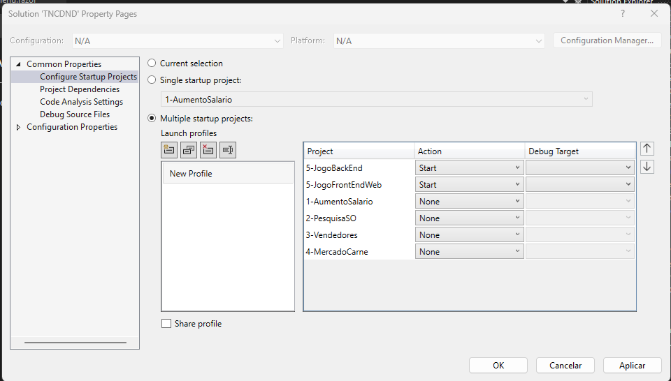
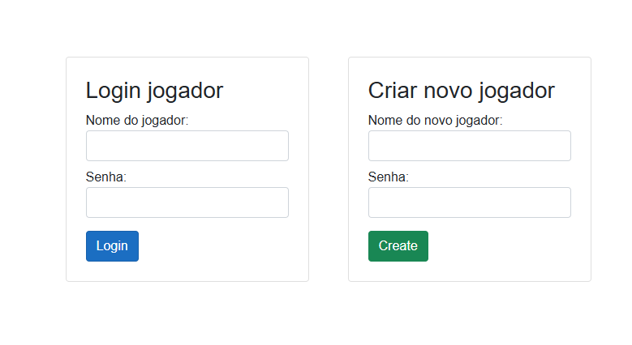
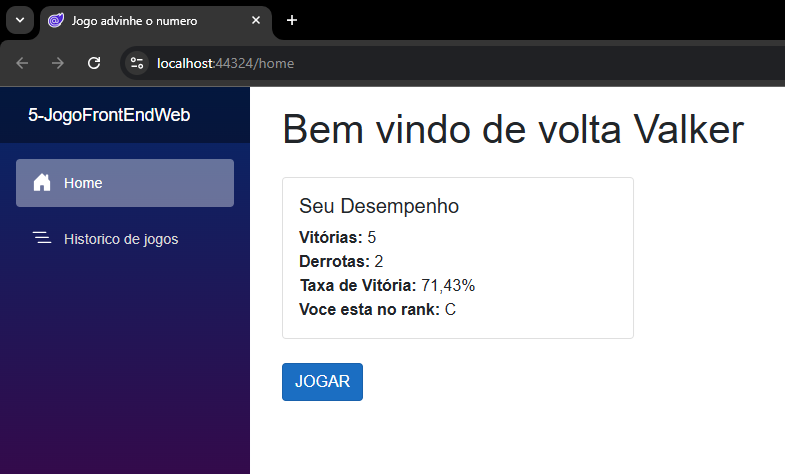
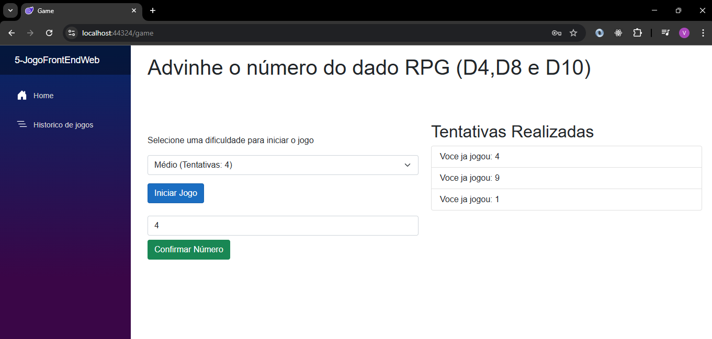
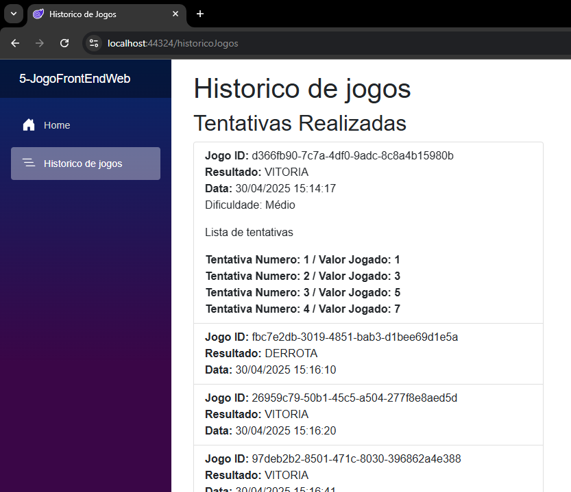

# Itens 1 a 4

Selecionar o projeto
Clique em 'Set as Startup Project'

# Item 5 - Jogo de Adivinhação de Número (Blazor + .NET + MongoDB)

Este projeto é um jogo interativo onde o jogador deve adivinhar o número de um dado RPG (D4, D8, D10). A aplicação foi construída com **Blazor** no frontend, **.NET Minimal API** no backend e **MongoDB** como banco de dados.

## 🧩 Funcionalidades

- **Histórico de Tentativas**  
  Todas as jogadas são registradas
  
- **Enum de Resultado**  
  Enum criado para representar o resultado da tentativa: `SUCCESS` ou `WRONG`.

- **Dificuldades**  
  Um dicionário retorna as dificuldades disponíveis (`D4`, `D8`, `D10`) com o número de tentativas permitidas para cada uma.

- **Validação de Tentativas Repetidas**  
  Caso o jogador tente um número já utilizado anteriormente, a jogada é perdida e uma mensagem de aviso é exibida.

- **Histórico do Jogador**  
  O jogador pode visualizar o histórico completo de suas tentativas e também o histórico de uma partida específica.

- **Contador de Vitórias e Derrotas**  
  Calcula e exibe a quantidade de acertos e erros, bem como a porcentagem de vitórias.

- **Rank por Desempenho**  
  Com base na porcentagem de vitórias, o jogador é classificado em um dos seguintes níveis:
  - E, D, C, B, A
  - Jogadores com 100% de acerto recebem o rank especial `S`.

## 🛠️ Tecnologias Utilizadas

- [Blazor WebAssembly](https://dotnet.microsoft.com/apps/aspnet/web-apps/blazor)
- [.NET 7 Minimal API](https://learn.microsoft.com/aspnet/core/fundamentals/minimal-apis)
- [MongoDB](https://www.mongodb.com/)
- [Blazored LocalStorage](https://github.com/Blazored/LocalStorage)

## 🔧 Como Executar o Projeto

1. Clone o repositório:
   ```bash
   git clone https://github.com/seu-usuario/nome-do-repo.git

2. Instalar MongoDb compass e CONFERIR A PORTA (padrão: mongodb://localhost:27017)

3. Abra a Visual Studio
   -> Clique com o botão direito em Solution
   -> Properties
   -> Cliquem em 'Start' no 'JogoBackEnd' e 'JogoFrontEndWeb' para iniciar a API e o Front Blazor

   
   
4. Crie um jogador


      

5. Na tela home, clique em "Jogar" (As estatisticas e rank vão aparecer conforme vc for jogando)

      

6. Seleciona a dificuldade de clique em jogar.
Conforme vc for errando as tentativas vão ser listadas ao lado

      
   
7. Historico de partidas e dados na mesma na opção de 'Historico de jogos'

     
